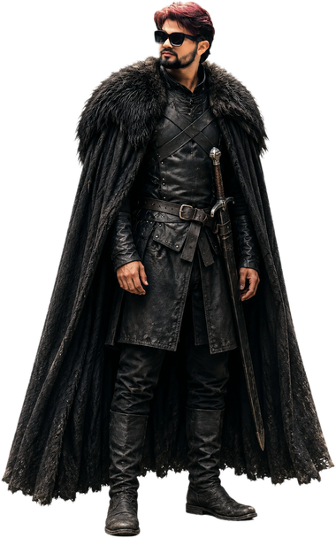

<div align="center">

<!-- Wave Banner (Top) -->


<a href="https://git.io/typing-svg">
  
</a>

<br/>


</div>

---

<div align="center">

<!-- Avatar -->


# ⚔️ Amit Kumar ⚔️
### Builder of Realms · Guardian of Code

*"Code is my sword, creativity my shield."*

<!-- Sigil -->


</div>

---

## 👑 Who I Am

```typescript
const amitKumar = {
  title: "Computer Science Student and Realm Builder",
  focus: ["Programming", "Artificial Intelligence", "Machine Learning"],
  stack: {
    languages: ["Python", "Java", "C"],
    web: ["HTML", "CSS", "JavaScript"],
    aiAndTools: ["Artificial Intelligence", "Machine Learning", "SQL"]
  },
  launchedProjects: ["Breast-Cancer-Diagnostic-ML"],
  currentlyForging: "Air Gesture Detection System (Guild Project)",
  certifications: [],
  status: "Apprentice in Machine Learning",
  openTo: ["Full-time quests", "Collaborations", "AI/ML campaigns"]
};
```

<br/>

## 🐉 Featured Realms

### ✨ Breast Cancer Diagnostic ML

A battle against disease using Logistic Regression, Flask, and React.

<a href="https://github.com/amitkumar15x/Breast-Cancer-Diagnostic-ML">
  
</a>

| Layer | Weapon |
|---|---|
| ML Model | Logistic Regression |
| Backend | Flask |
| Frontend | React |

🔗 [Code](https://github.com/amitkumar15x/Breast-Cancer-Diagnostic-ML)

<br/>

### 🖐️ Air Gesture Detection System

A guild project harnessing Computer Vision and ML to command devices with hand gestures.

| Layer | Weapon |
|---|---|
| Vision | Computer Vision |
| ML | Machine Learning |

> Note: This is a group project hosted on a teammate's GitHub account, so no pin card is shown here.

<br/>

## ⚔️ Tech Arsenal

**Languages of the Realm**


**Forging Web Realms**


**Arcane AI / Databases / Tools**


<br/>

## 📊 Chronicles of Code

<div align="center">


</div>

## 🏆 Trophies of the Realm

<div align="center">

</div>

## 📈 Contribution Saga

<div align="center">

</div>

<br/>

## 🌐 Connect With Amit Kumar

<div align="center">

[](https://www.linkedin.com/in/amitkumar15x)
[](https://twitter.com/amitchauhan15x)
[](mailto:amitkumar155x@gmail.com)
[](https://github.com/amitkumar15x)

</div>

<br/>

<div align="center">

⭐ **Always Learning • Always Forging • Always Improving** ⭐

<!-- Wave Banner (Bottom) -->


</div>
